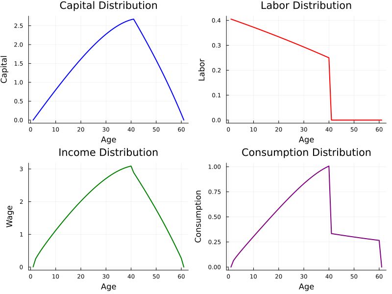

# AK60

Named after Auerbach & Kotlikoff (1987)'s 60-period lived OLG.

The main source of inspiration comes from Heer's DGEM book. 2009 version.

This is a simple life-cycle model with deterministic retirement without human capital or survival probabilities. 

Each period, an agent makes two decisions: how much to save and how much to supply their labor on the market. The desired output is two series of age-profile capital holdings and labor supply. The model can be solved using direct computation or value function iteration.

Output:

